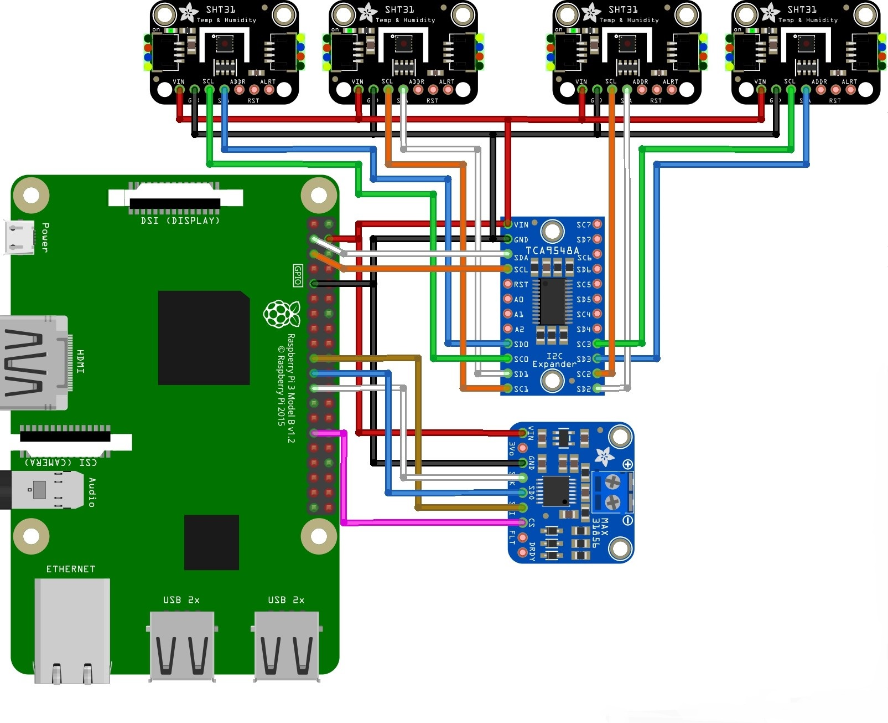
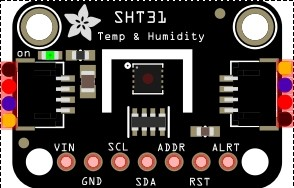
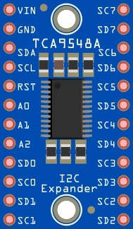
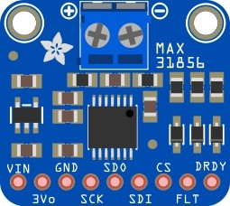
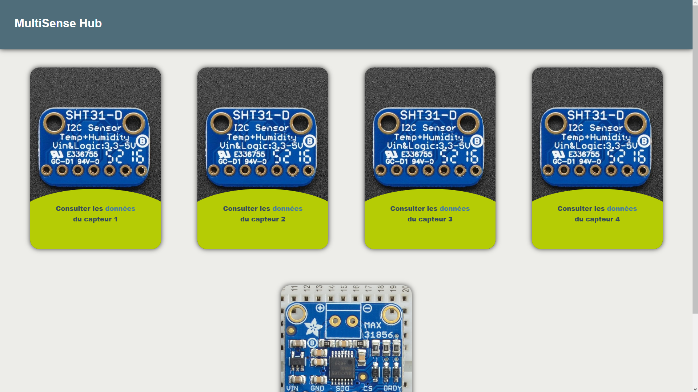
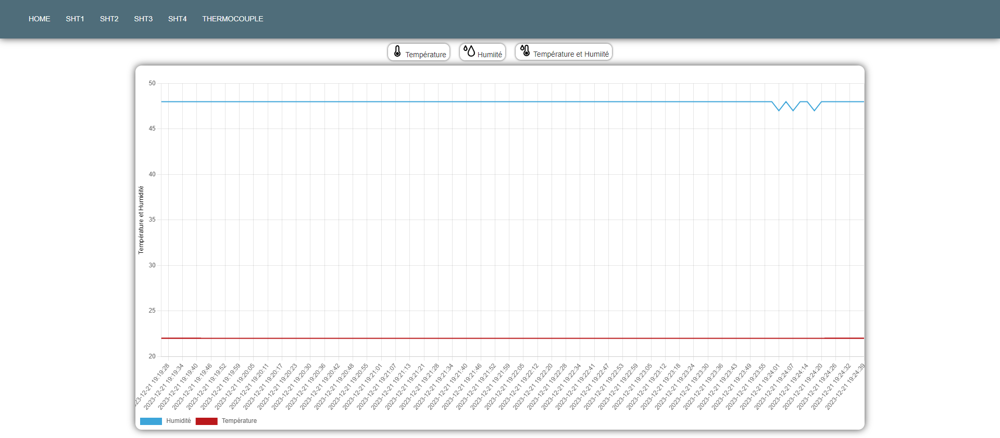

# 

MultiSense-Hub est un projet développé au sein du Laboratoire Universitaire Hubert Curien lors de mon dernier stage. Il s’agit d’un appareil polyvalent conçu pour collecter les données environnementales. MultiSense-Hub utilise des capteurs SHT31-D et un thermocouple pour recueillir des données précises, qui sont ensuite affichées sur une interface web pour une analyse facile et accessible. L’objectif à long terme de MultiSense-Hub est d’intégrer une variété de capteurs supplémentaires, augmentant ainsi sa polyvalence et sa capacité à surveiller divers aspects de l’environnement.

## Sommaire

- [Schema](schema)

## Schéma
-  rouge  : **5V**
-  noir  : **GND**

#

## Rasberry Pi 3

Le rasberry pi (RPI) aura connecter a ses port GPIO un multiplexer pour augementer le nombre de caneaux I2C qu'il a sa disposition, de plus ca permetera de detecter les nouveaux capteurs SHT31 quand il seront connecter.

Un écran de 7 pouce va se trouver sur le boitier qui va acceuir le tout, il permetera d'afficher des courbe relatifs aux données colecté.

Un point d'acces au réseau local permetera la consultation de ses donnée depuis ce dernier de maniere sécurisé.

L'OS du RPI est : **Raspberry pi OS 64 bits**

## SHT31-D

    

C'est un capteur qui se connecte a un support (rasberry pi / arduino / esp32 ...) via le canal I2C.

## Multiplexer TCA9548A

    

L'interet du multiplexer est de permettre de mettre 8 autres port I2C, grace au programme lorsqu'on on va venir brancher un nouveau capteur il sera automatiquement reperer et il commencera directement les mesures, dans notre cas il en faudra pas 8 mais le programme pourra être réutiliser pour un projet dans le futur qui va nécéssiter 8 canaux I2C.

## MAX31856 + Thermocouple type K

    

Le module de Adafruit MAX31856 permet d'amblifier et de lire la température d'un thermocouple il utile pour cela le canal SPI. Le module est polyvalent et s'adapte en fonction du type de thermocouple utilisé, dans notre cas un K, les thermocouples de ce type sont conçus principalement pour les mesures de température générales dans des atmosphères les plus courantes donc parfait pour notre utilisation.

## Fonctionnement

Le rasberry fera objet de serveur web et de collecteur de données, il y aura une BDD (Base de Données) avec MySQL (MariaDB).

## Serveur web Apache2

Un serveur web qui permet d'acceder a tout les capteurs et leur donnée en temps réel est accesible avec l'ip du RPI

Les page web sont similaire, elle posede un graphique des données et  on peut choisir les données a affiché.

## Organisation des fichiers

Sur le desktop de l'user par défaut (User) on retrouvera un répertoire `"programs"` dans le quel il y aura 2 autres répertoire `"scripts"` et `"python"`.

Dans /python :

- ``sht-reader.py`` (lit les données des capteurs SHT et les envoi dans la BDD)
- ``max31856-reader.py`` (lit les données du thermocouple et les envoi dans la BDD)

Dans /scripts :

- ``apache2.sh`` (installation de apache2)
- ``phpmyadmin.sh`` (installation de phpmyadmin)
- ``python-venv-libs.sh`` (création et installation de l'envirenement avec toutes les bibliotheque)
