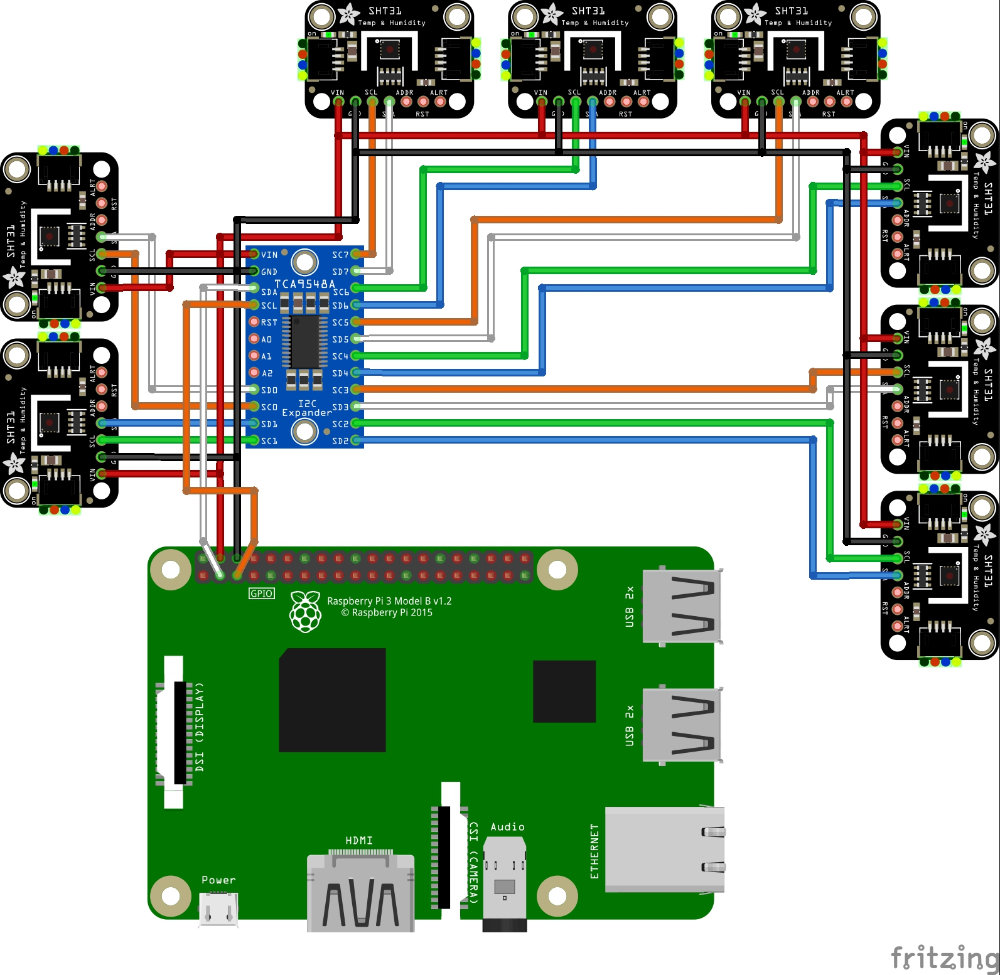

# Affichage donnée ambiante via un Rasberry Pi

Le projet consite a crée un appareil de est capable de récuprer les donnée produite par des capteurs SHT31-D

## Sommaire 

## Schéma

Fils :

- rouge : 5V
- noir : GND
- bleu/orange : SDA
- vert/blanc : SCL

## Rasberry Pi 3

Le rasberry aura connecter a ses port GPIO un multiplexer pour augementer le nombre de caneaux I2C qu'il a sa disposition, de plus ca permetera de detecter les nouveaux capteurs SHT31 quand il seront connecter.

Un écran de 7 pouce va se trouver sur le boitier qui va acceuir le tout, il permetera d'afficher des courbe relatifs aux données colecté.

Un point d'acces au réseau local permetera la consultation de ses donnée depuis ce dernier de maniere sécurisé.

## SHT31-D

C'est un capteur qui se connecte a un support (rasberry pi / arduino / esp32 ...) via le canal I2C.

## Multiplexer TCA9548A

L'interet du multiplexer est de permettre de mettre 8 autres port I2C, grace au programme lorsqu'on on va venir brancher un nouveau capteur il sera automatiquement reperer et il commencera directement les mesures, dans notre cas il en faudra pas 8 mais le programme pourra être réutiliser pour un projet dans le futur qui va nécéssiter 8 canaux I2C.

